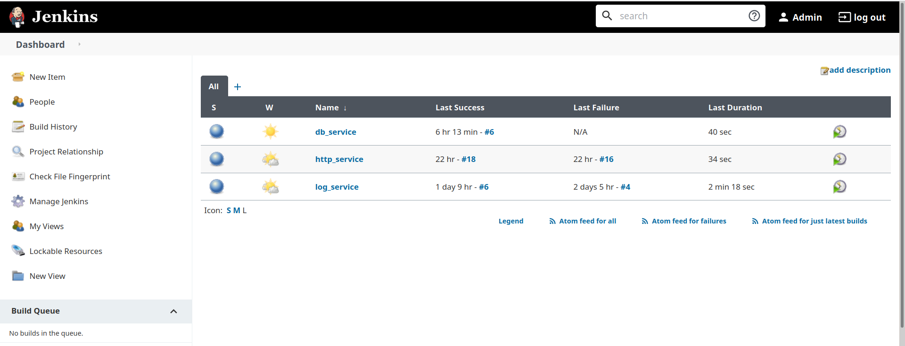

# Jenkins Setup Guide

The leading open source automation server, Jenkins provides hundreds of plugins to support building, deploying and automating any project.

This guide will give you enough information to automated registry image push process from git commit.

### Installing Jenkins
- Install jenkins from official page according to your choice - [click](https://www.jenkins.io/doc/book/installing/) .

After successfully completing jenkins installation process and login you will land on jenkins dashboard which look like as below

### Adding secrets in jenkins for using private git repository
- To add Secrets Click on **Manage Jenkins** Menu then choose **Manage Credentials** .
- Now choose Jenkins to store Credentials.
- Click on **Add Credentials** Menu and then fill the details in form like username,password and provide a name to remember then save Credentials.

### Creating New Items For Automation
- Click on **New Item** from main menu .
- Select Freestyle project and provide a name to this item.
- Now add little  Description .
- Choose **git** for **Source Code Management** and provide repository url and select Credentials that we created in above steps to access these repo.
- Now choose **Trigger builds remotely** option for Build automatic Triggers then Provide a token name that will be used to apply webhooks on repo.
- Now At last tell jenkins what to do when a trigger comes to jenkins. Add Commands of your choice and save the setting.

### Add WebHooks to repo
- Go to setting of repository.
- Find Webhooks tab and then click add webhook and choose gitea[ in my case you can use yours]
- Provide Target Url that is provided by jenkins when you added a token on trigger build.
    - eg:- https://jenkins-service.com/job/[1]/build?token=[2]

    - [1] = Your Item Name, [2] = Your token name form jenkins
- Click on Add webhook Its done, Now  test this webhook by clicking on test delivery button.

