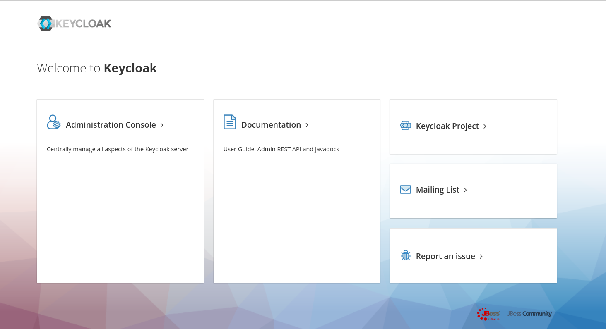
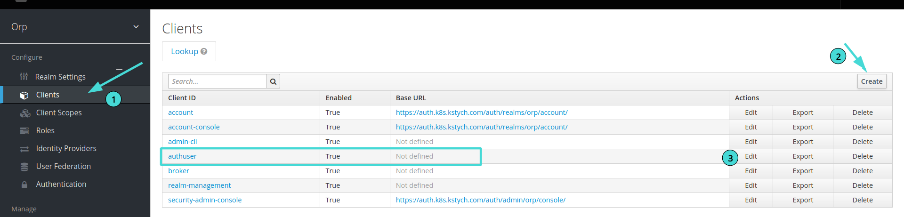
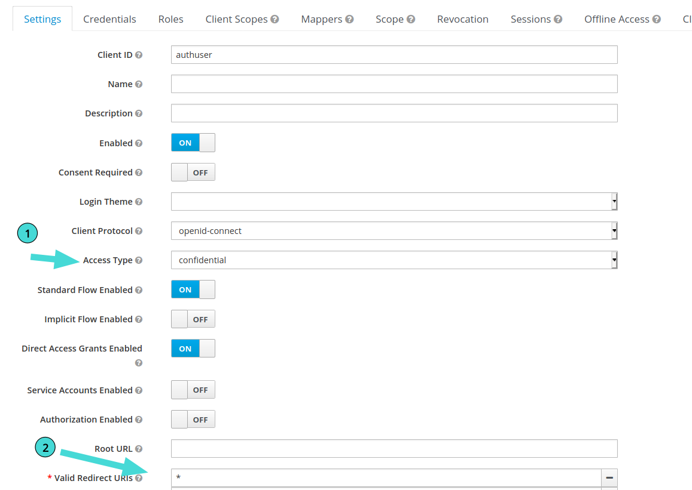

# Keycloak Setup

Open Source Identity and Access Management For Modern Applications and Services.
This is simple minimal guide to just get started with keycloak on quarkus for authentication.

## Contents
- Installing Keycloak
- Configuring Keycloak
- Configuring quarkus to use keycloak
- Sample program to use keycloak in quarkus

### Installing Keycloak
Install Keycloak from [here](https://www.keycloak.org/getting-started) according to your choice eg: Docker, K8s, JDK, etc..

 After successfully Installing Keycloak you will have home page like shown below.



### Configuring keycloak

- To get started click on Administration Console and login with your username & password that you created when installing keycloak.

- After successfully login you will land on keyclock dashboard then follow below steps:-
    - Create a new realm according to your name choice by clicking on Add ream button located at top-right-corner.

    - Add a demo client
        - Click on **client** menu and then create new client by clicking on **create** button.

    
    - Now config Client with these minimal settings
        - Change Access Type to **confidential**
        - Add * in Valid Redirect URLs.
        - Save the settings and its done for demo client configuration.
    

    - Add a demo user
        - Click on **Users** menu and add new user with simple username and password.

- Now you are all set with keycloak minimal configuration for getting started authencation on quarkus.

### Quarkus Configuration

- Add **oidc** extension to your existing quarkus project.
```
./mvnw quarkus:add-extension -Dextensions="oidc"
```

- This will add follwing code in you **pom.xml** file.
```
<dependency>
    <groupId>io.quarkus</groupId>
    <artifactId>quarkus-oidc</artifactId>
</dependency>
```
- Now add the follwing configuration for keycloak authencation in your **application.properties** file located in  **resources** folder .

```
    # OIDC Configuration

    # url structure - https://domain/auth/realms/realm-name
    quarkus.oidc.auth-server-url=https://xxx.myapp.com/auth/realms/orp/


    quarkus.oidc.client-id=authuser #here use client id that you created above
    quarkus.oidc.application-type=web-app

    # keycloak client secrets
    quarkus.oidc.credentials.secret=6fb02972-133e-4b32-9e9a-f5505af54683

    # Set logout path
    quarkus.oidc.logout.path=/logout
    quarkus.oidc.logout.post-logout-path=/

```

- Now open your java file where you want to authenticate user

    - Import these libraries for authencation.
    ```
        //Authentication
            import io.quarkus.security.Authenticated;
            import io.quarkus.security.identity.SecurityIdentity;

    ```
    - Now just use **@Authenticated** flag on the path where you need authentication.
    - Now whenever user hit that path where you added **@Authenticated**  user will be redirected to keycloak and after authentication process user will again redirect to your application.
    - Quarkus will automatically manage tokens and verfication for user.
    - Now if you want to get username of logged in user use below command.
```
    @Inject
    SecurityIdentity securityIdentity;

    String username = securityIdentity.getPrincipal().getName();
```

- Now test the code its all done!.

#### For More Detail about Keycloak & Quarkus
- Documentation - [click](https://www.keycloak.org/documentation)
- Quarkus - [click](https://quarkus.io/get-started/)
