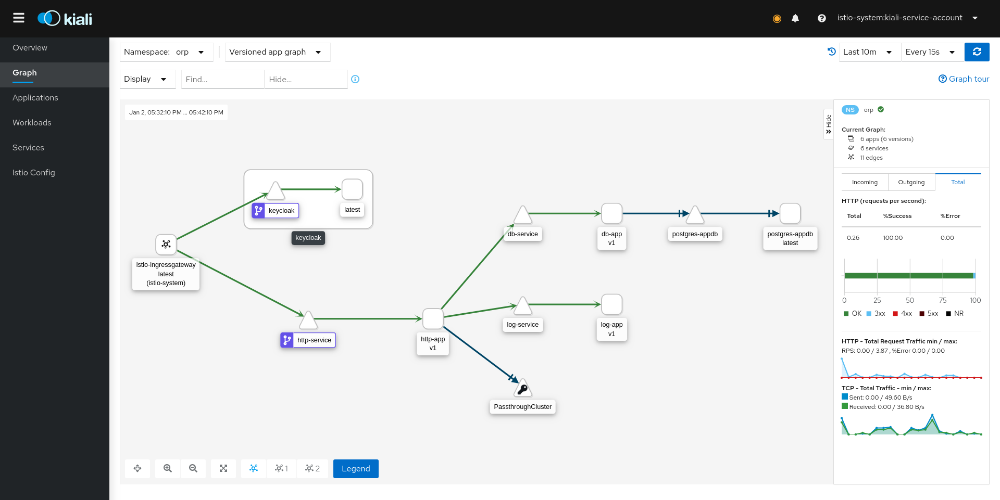

# k8s-microservice-devops-demo
Kubernetes Istio Microservice Demo with full CI-CD Pipeline



```
Technologies Used :

K8S (choose any)
  minikube
  kubeadm
  **k0s**
  AWS EKS
  GCE GKE

  LensApp
  Gluster,NFS,AWS-EBS
  Istio
  Helm
  Prometheus
  Grafana
  Kiali
  Cert-Manager

CICD
  Jenkins
  Docker-Registry:2
  Git Server (any. gitlab,gitea,..)

Java Microservice
  KeyCloak + oAuth,JWT,Roles
  Quarkus
  Redis


Design : http service does auth/role/any other ACL check. all other services stateless
  Deployment/Service : app-http
  Deployment/Service : app-db + db
  Deployment/Service : app-web
  Deployment/Service : app-log
  Deployment/Service : app-storage
  Deployment/Service : app-bus
  Deployment/Service : app-cache
```
